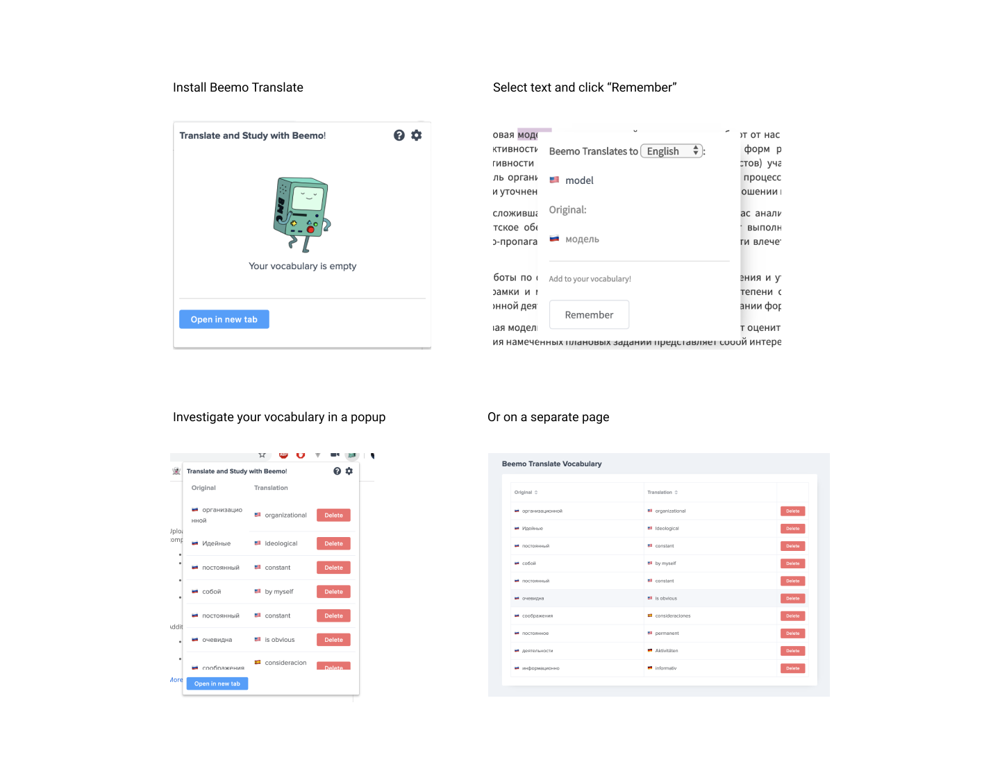

Meet the most friendly Chrome Translation Extension!

# Beemo Translate!

Beemo Translate is a Chrome extension that translates selected text into different languages and gives possibility
to add your translation pair to your own vocabulary.
Install it from the [Chrome Webstore](unfortunately extension is on Chrome Store review).
This project is pretty young, but is made with love and attention to details:

- Translates text on selection or double click.
- Allows to select language to translate to (Ukrainian(default), English, German, Spanish, French). 
- Allows to add translation pair to your personal vocabulary.
- Shows your vocabulary in a pretty popup or in a separate tab.
- Gives possibility to manage your vocabulary (add / remove).
- Provides options, devtools (in development for now).

New amazing features are coming soon!

> Please note that the extension is not available to run on all pages as some sites prevent
content script injection, or API used for translation can be aborted due to site Content-Policy permissions. 
:(

## Usage

- Install the extension
- Select text or double click on the word
- Select preferred language to translate to.
- Add translation pair to vocabulary by pressing "Add to Vocabulary" button.
- Click "Beemo Translate" icon on the browser top panel.
- Here your vocabulary! Study and Manage it from here or click "Open in a new tab" to open it in a separate tab.
- If you want to read more about Beemo Translate or have some questions press the question mark icon in the popup (browser top panel)

Enjoy!

## Development

1. Run dependencies: `npm install`
2. Build the project: `npm run dev`
3. To build a zip file for production: `npm run build-zip`
4. Run the application: `npm run dev`
5. Wait will extension is built and navigate to chrome://extensions
6. Make sure 'Developer mode' is checked
7. Click Load unpacked extension...
8. Select `build` folder to load

## 
Dedicated to all Adventure Time fans <3

